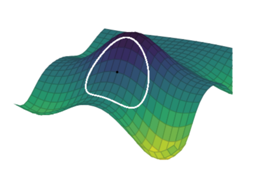

# Trust region method
[Descent methods](local_descent.md) can place too much trust in their first or second order approximations, that can lead to excessively large steps or premature convergence. A trust region is the local area of the design space where the local model is believed to be reliable. A trust region method (restricted step method) maintains a local model of the trust region that booth limits the step taken by traditional line search and predicts the improvement associated with taking the step. If the improvement closely matches the predicted value, the trust region is expanded. If the improvement deviates from the predicted value the trust region is contracted. 

Trust region methods first choose the maximum step size and then take the step direction. The next step is found by minimizing an objective function $\hat{f}$ over a trust region centered at the current design point x. ($\hat{f}$ can be a second order taylor approximation). The radius of the trust region $\delta$ is expanded or contracted based on how well the model predicts function estimations.

The next design point $x'$ is obtained by solving:

$$
\min_{x'} \hat{f}(x') \\
\text{ s.t } \; \; ||x - x' || \le \delta
$$

The trust region radius $\delta$ is contracted or expanded based on the local model predictive performance. Trust region methods compare the predicted improvement $\nabla y_{\text{pred}} = f(x) - \hat{f}(x)$ to the actual improvement $y_{\text{act}} = f(x) - f(x')$

$$
\eta = \frac{\text{actual improvement}}{\text{predicted improvement}} = \frac{f(x) - f(x')}{f(x) - \hat{f}(x')}
$$

Now if:
* $\eta$ is close to 1, then the predicted step matches the actual step size. 
* $\eta$ is too small (below some threshold), then the improvement is considered sufficiently less and the trust region is scaled down. 
* $\eta$ is large (above some threshold) we scale up the trust region.
