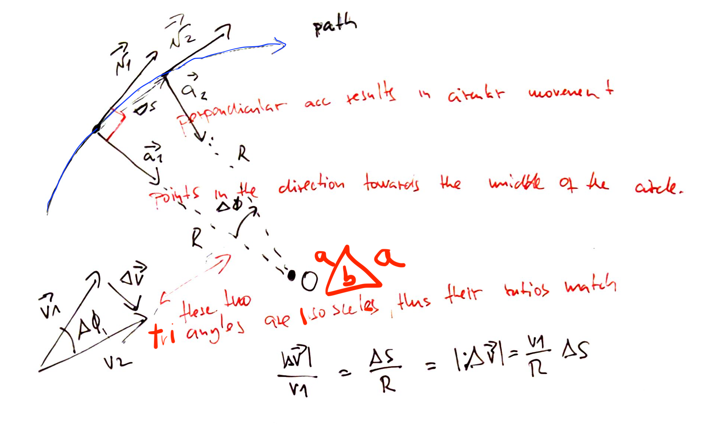
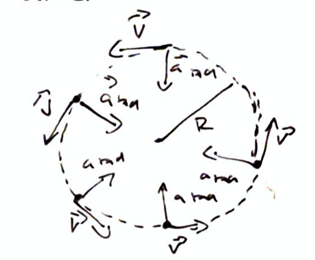
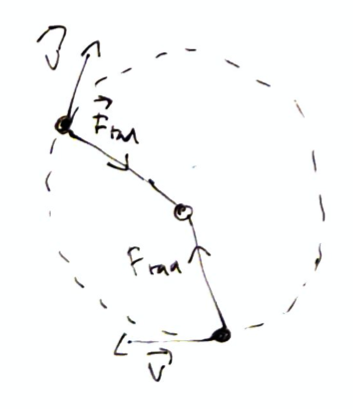
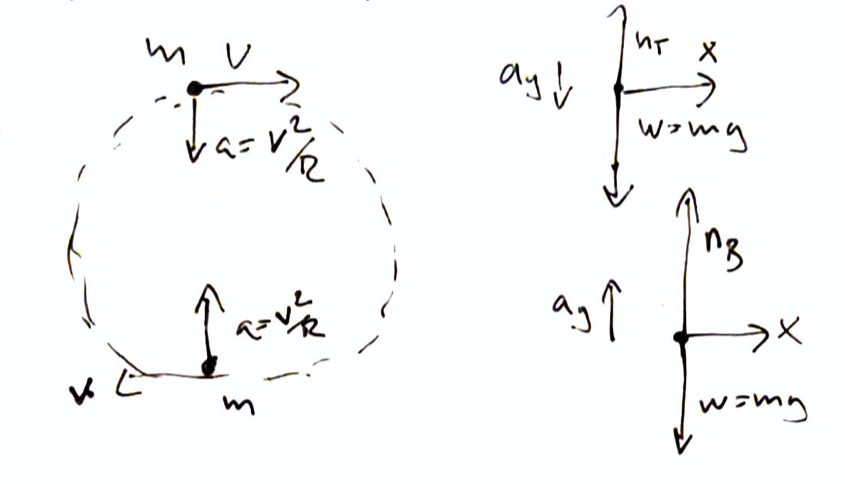

# Uniform circular motion
We move in a circle with constant speed. Thus there is acceleration that is perpendicular to the path (If it would be along than we would increase the speed).

The velocity at each point changes, while the acceleration always points towards the Origin of the circle. The magnitude of the change of velocity is defined as:

$$
|\Delta \vec{v}| = \frac{v_1}{R}\Delta s
$$

From this we can calculate the average acceleration:

$$
a_{av} = \frac{|\Delta \vec{v}|}{\Delta t} = \frac{v_1}{R}\frac{\Delta s}{\Delta t}
$$

The instantaneous acceleration is:

$$
a = \lim_{\Delta t \rightarrow 0} 
 \frac{v_1}{R}\frac{\Delta s}{\Delta t} =  \frac{v_1}{R} \lim_{\Delta t \rightarrow 0} \frac{\Delta s}{\Delta t}
$$

The limit of $\frac{\Delta s}{\Delta t}$ is the speed $v_1$ at point A, which is constant at every point on the path. This makes:

$$
\lim_{\Delta t \rightarrow 0} \frac{\Delta s}{\Delta t} = v
$$

And the acceleration is:
$$
a_{rad} = \frac{v^2}{R}
$$

> This acceleration is **radial** (points always to the center of the circle, and perpendicular to the objects velocity)
> It is proportional to the square of speed $a_{rad}\propto v^2$ and inversely proportional to the radius $a_{rad} \propto \frac{1}{R}$

Since we move in a circle we can express the motion using time until a full revolution happens.

$$
v= \frac{2 \pi R}{T} \\
a_{\text{rad}} = \frac{2\pi^3 R}{T^2}
$$

Since there is inward acceleration, there must be a force that points inward.

This force can be expressed as:

$$
F_{\text{net}} = m a_{\text{rad}} \\
F_{\text{net}} = m \frac{v^2}{R}
$$

## Vertical circle
There is a special case when we move in a vertical circle, an example is a Ferris wheel:

Here the force that act at the top of the wheel and at the bottom of the wheel are special.

At the top:
$$
n_t + (-mg) = m(-a_{\text{rad}}) \\
n_t + (-mg) = m(-\frac{v^2}{R}) \\
n_t = mg(1 - \frac{v^2}{gR})
$$

The seat excerpts lower normal force.

At the bottom:

$$
n_b + (-mg) = ma_{\text{rad}} \\
n_b + (-mg) = m \frac{v^2}{R} \\
n_b = mg(1+\frac{v^2}{gR})
$$

The seat excerpts greater normal force.