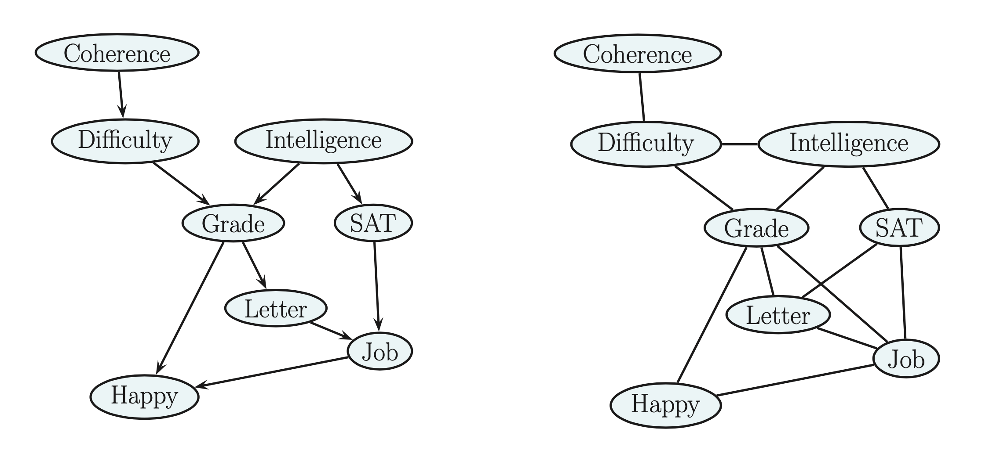
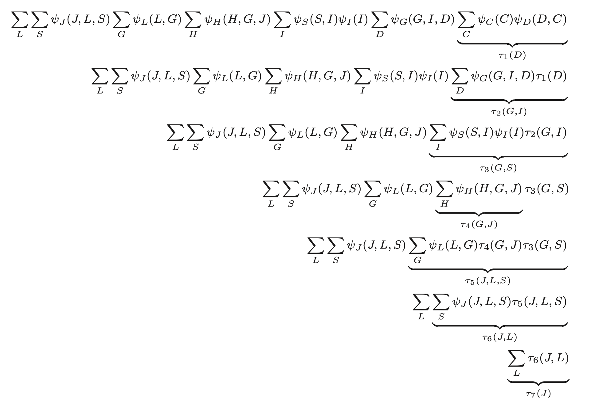

# Variable elimination algorithm

This extends Belief propagation so we can compute $p(x_q|x_p)$ for any kind of graph. 

> Example of getting an job given some conditions
> 

This has the form:

$$
P(C,D, I,G, S,L, J,H) = P(C)P(D|C)P(I)P(G|I,D)P(S|I)P(L|G)P(J|L, S)P(H|G, J)
$$

We can convert to an UGM where we define a potential function for every CPD yielding:

$$
P(C,D,I,G,S,L,J,H) = \psi_C(C) \psi_D(D,C) \psi_I(I) \psi_G(G,I,D) \psi_S(S,I) \psi_L(J,L,S) \psi_H(H,G,J)
$$

The UGM has more edges than the DAG. Since **normalization** connect all the unmarried nodes.  Now if we want to compute $p(J=1)​$, the marginal probability that a person will get a job. This can be achieved by summing up all the possible variables:

$$P(J) = \sum_L \sum _S \sum_G \sum_H \sum_I \sum_D \sum_C p(C,D,I,G,S,L,J,H)​$$

Tthis can take $O(2^7)$ time. 

We can reduce on this if we manage to push sums inside products. This is the key idea behind **variable elimination** algorithm called **bucket elimination**.

$$
p(J) = \sum_{L,S,G,H,I,D,C} p(C,D,I,G,S,L,J,H) = \\
\sum_{L,S,G,H,I,D,C} \psi_C(C) \psi(D,C)\psi_I(I)\psi_G(G,I,D)\psi_S(S,I)\psi_L(L,G) \psi_j(J,L,S)\psi_H(H,G,J) \\ 
= \sum_{LS}\psi_J(J,L,S) \sum_G \psi_G \psi_G(L,G) \sum_H \psi_H(H,G,J)\sum_I \psi_s(S,I)\psi_I(I)\sum_D \psi_G(G,I,D) \sum_C \psi_C(C) \psi_D(D,C)
$$

Now we can evaluate this expression, working right to left as:

We can use this to compute any marginal of interest like $p(J)$ or $p(J,H)$. To compute the conditional, we can take ratio of two marginals, where the visible variables have been clamped to their known values. 

Unfortunately **Variable elimination** can be exponentially slow in the worst case.

## Computational complexity of VE

The running time of VE is exponential in the size of the largest factor, since we have to sum over all of the corresponding variables. Some of the factors come from the original model, bu **new factors** are created in the process of summing out. Therefore if we are not careful we can introduce unnecessary factors, and slow down the computation.

The order in which we perform summation is known as **elimination order**. This can have a large impact on the size of the intermediate factors that are created.  Unfortunately finding the best elimination order is NP hard. 
