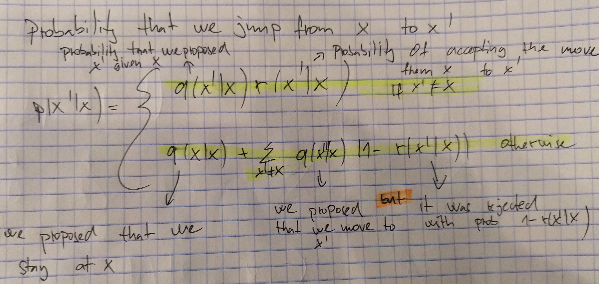

# Why HM works
To prove that HM procedure generates samples from $p^*$, we have to use a bit of Markov chain theory. 

The HM algorithm defines a Markov chain with the following transition matrix:

$$
p(x'|x) = \begin{cases}
    q(x'|x)r(x'|x) & \text{ if } x' \ne x \\
    q(x|x) + \sum_{x'\ne x}q(x'|x)(q- r(x'|x)) & \text{ otherwise }
\end{cases}
$$

If we analyze this Markov chain, it has to satisfy the [detailed balance equation](stationary_distrion.md)

$$
p(x'|x)p^*(x) = p(x|x')p^*(x')
$$

Now if the chain statisfies the detail balanced equation, then $p^*$ is its stationary distribution. Our goals is to show that HM algorithm defines a transition function that satifies detailed balance, thus $p^*$ is its stationary distribution. (If this equation hold we can say that $p^*$ is an **invariant**  distribtuion with respect the Markov transition kernel q).

**Theroem**

*If the transition matrix defined by HM algorithm is ergodic and irreducible, then* $p^*$ *is its unique limiting distribution*

