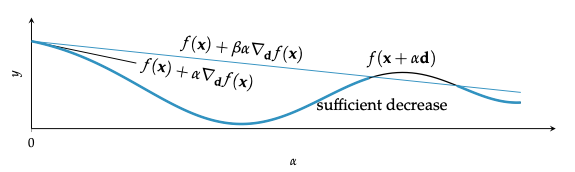
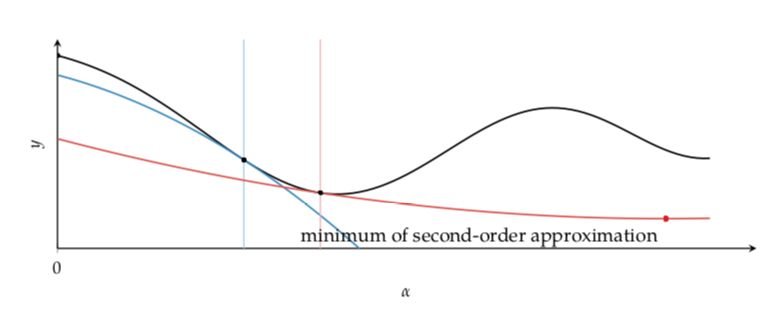
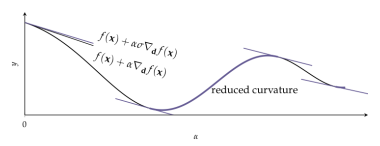
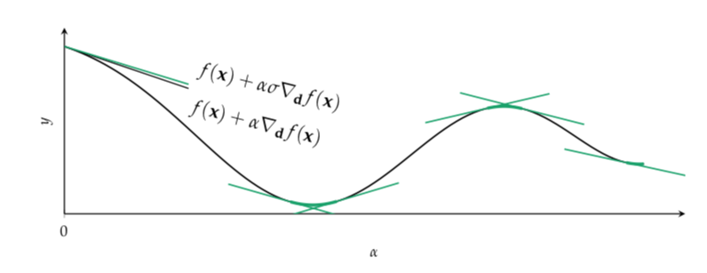

# Wolfe Conditions

They relate to [local descent](local_descent.md) and advise how to [pick $\alpha$](line_search.md) in:

$f(x + \alpha d)$

## First Wolfe conditions

If $d$ is a valid descent direction, then there exists a sufficiently small step size that satisfies the sufficient decrease condition.

The first Wolfe condition is insufficient to guarantee convergence to a local minimum. Very small step sizes will satisfy the first condition but will prematurely converge.

## Second Wolfe condition Curvature condition

Requires the directional derivative at the next iterate to be shallower:

$$
\nabla_{d^{(k)}} f(x^{(x+1)}) \ge \delta \nabla_{d^{(k)}} f(x^{(k)})
$$

$\delta$ controls how shallow the next directional derivative must be. We commonly set it to be $\beta < \delta < 1$. (For Conjugate gradient with approximate line search we set $\delta = 0.1$, for Newtons method $\delta = 0.9$)

The second Wolfe condition is necessary to ensure that the second order function approximation have positive curvature. 

Regions where the curvature condition is satisfied.

## Strong Wolfe condition 
An altenrative to the curvature conditions (more restrictive). It requires that the slope is not too positive:

$$
|\nabla_{d^k} f(x^{(k+1)})| \le - \delta \nabla_{d^k}f(x^{(k)})
$$

* Together the sufficient decrease condition (First Wolfe) and the first curvature condition (Second Wolfe) form the Wolfe conditions.

* The sufficient decrease condition with the second curvature condition form the strong Wolfe condition.
