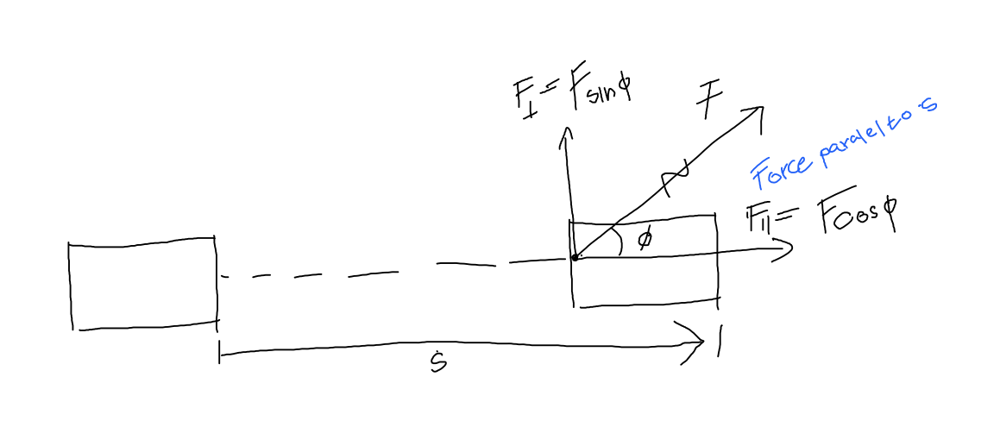
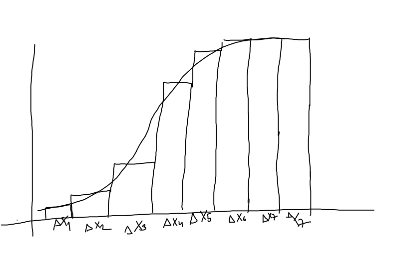
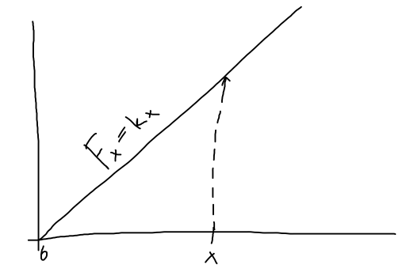

# Work

When an object undergoes displacement $\vec{s}$ with magnitude s along a straight line, while a constant force $\vec{F}$ with magnitude F, making an angle $\phi$ with $s$ acts on the object, the work done by the force on the object is defined:

$$
w = F_{\parallel}s = F(\cos \phi) s
$$

Units of work:

$$ \text{J} = \text{N} \cdot \text{m} $$

One Joul = Newton $\cdot$ meter. Joul is scalar, and ti can be negative, if the force that we apply is under angle $90 < \phi < 270$, thus we try to stop an moving object.

If an object is sliding, the work done by the normal force is 0, (there is no upward motion). If an object is moving in a circle, the work done by the normal force is zero.

## Work and kinetic energy

Lets assume a particle undergoes constant acceleration from $v_i$ to $v_f$ during displacement s, the final velocity can be expressed as:

$$
v^2_f = v_i^2 + as \\ 
a = \frac{v_f^2 - v_i^2}{2s}
$$
The force acting on a particle with mass $m$ is:

$$
F_{\text{total}} = m a \\ 
= m \frac{v_f^2 - v_i^2}{2s}
$$

From this we can define the work done by a particle:

$$
F_{\text{total}} s = \frac{1}{2}mv_f^2 - \frac{1}{2}mv_i^2  
$$

From this we can define the kinetic  energy of a particle:

$$
K = \frac{1}{2}mv^2
$$

* $K > 0$ no matter what

Thus if we apply force we can change the kinetic energy of an object. The total work is the difference between the final and initial kinetic energy.

$$
W_{\text{total}} = K_f - K_i = \Delta K
$$

## Work done by a varying force
Here the force acting on a object varies in booth magnitude and direction, or force that acts on an object along a curved path. 

First we assume we have a straight line direction, but we vary the force. To calculate the work done, we split into segments:

$$
w = F_1 \times \Delta x_1  + F_2 \times \Delta x_2  + \cdots \\
w = \text{ are under the curve}
$$

Lets look a at a string. The force required to stretch a string ([hookes law](elastic_forces.md)) is:

$$
F = kx
$$

* $k$ force (spring) constant

The work done by stretching a spring can be expressed as:

Thus as we elongate the spring from zero, to maximum value x the work is:

$$
w = \frac{1}{2} x(kx) = \frac{1}{2}kx^2
$$

Thus as we double the elongation the work increases by a factor of 4. We can generalize this lets assume the string is stretched to $x_i$ and we stretch it to $x_f$ than the work done is:

$$
w = \frac{1}{2}kx_f^2 - \frac{1}{2}kx_f^2 
$$